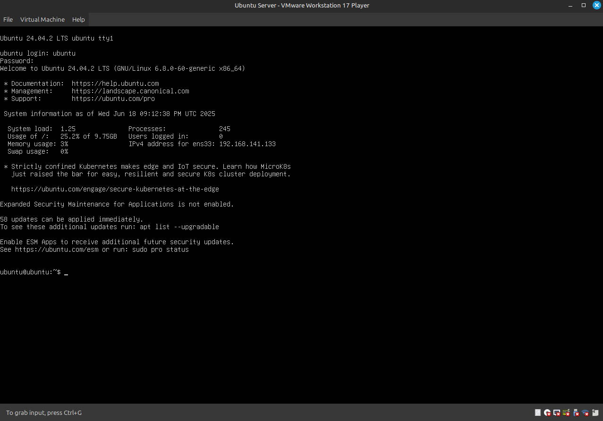
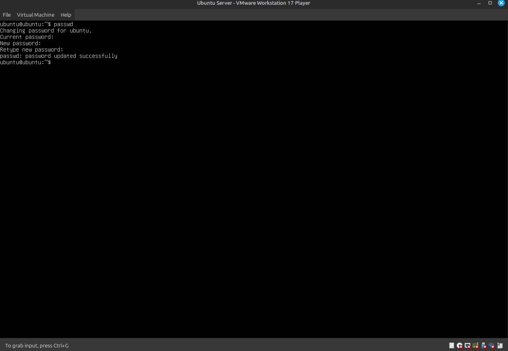

# Lab 1 — Управление учётной записью и базовая навигация

---

## 1. Вход в систему



* * *

## 2. Смена пароля

```bash
man passwd
passwd
Current password: ********
New password: SecurePass321
Retype new password: SecurePass321
passwd: password updated successfully
```




