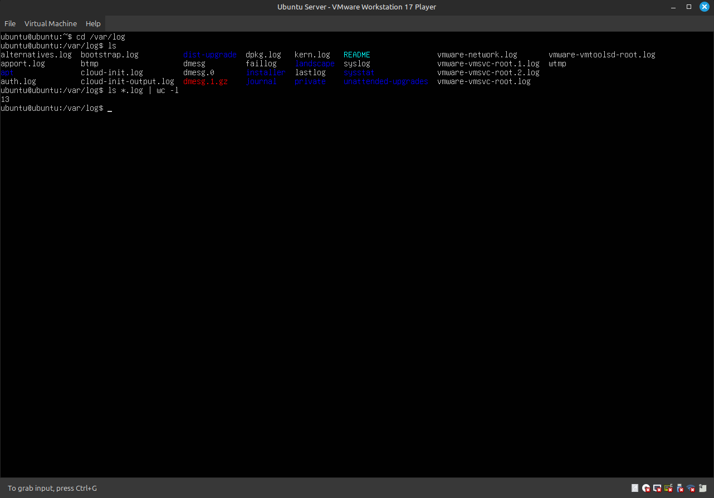
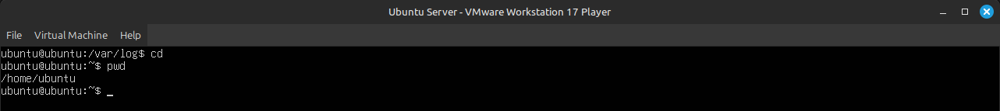
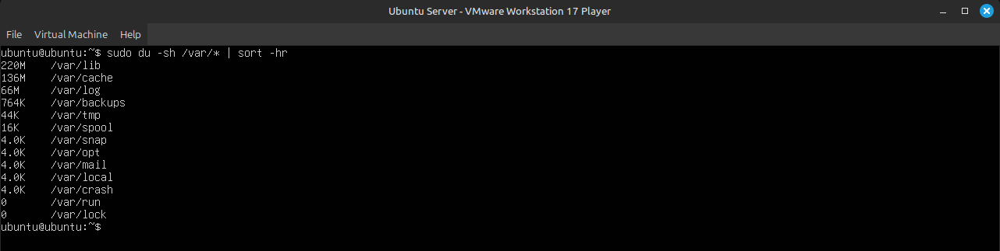
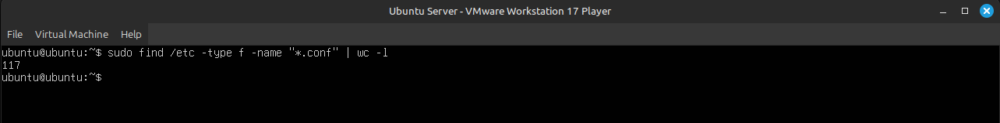
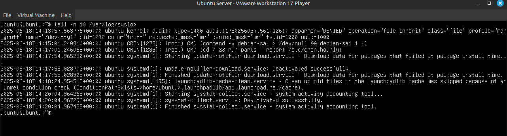
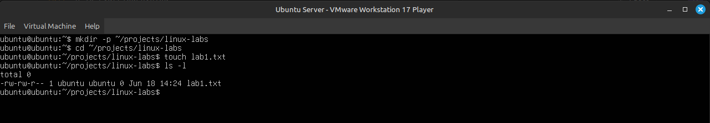

# Lab 1 — Управление учётной записью и базовая навигация

---

## 1. Вход в систему


* * *

## 2. Смена пароля

```bash
man passwd
passwd
Current password: ********
New password: SecurePass321
Retype new password: SecurePass321
passwd: password updated successfully
```


* * *

## 3. Переход в /var/log и анализ .log

```bash
cd /var/log
ls
ls *.log | wc -l
```



* * *

## 4. Переход домой и путь

```bash
cd ~
pwd
```



* * *

## 5. Размер директорий в /var

```bash
du -sh /var/* | sort -hr | head -n 10
```



* * *

## 6. Поиск .conf файлов в /etc

```bash
find /etc -type f -name "*.conf" | wc -l
```



* * *

## 7. Последние 10 строк из syslog

```bash
tail -n 10 /var/log/syslog
```



* * *

## 8. Создание каталога и файла

```bash
mkdir -p ~/projects/linux-labs
cd ~/projects/linux-labs
touch lab1.txt
ls -l
```



* * *

## Выводы:

- Смена пароля выполняется через `passwd`, справку можно открыть через `man`.
- Команды `cd`, `pwd`, `ls` помогают свободно перемещаться по системе.
- В каталоге `/var/log` можно быстро найти нужные логи по расширению `.log`.
- Команда `wc -l` удобна для подсчёта количества строк/файлов.
- `du -sh` и `sort -hr` помогают оценить, какие папки занимают больше всего места.
- Поиск файлов по шаблону удобно делать через `find`.
- `tail` позволяет быстро просматривать свежие строки в логах.
- Создание директорий и файлов (`mkdir`, `touch`) — базовая, но важная часть работы с CLI.
