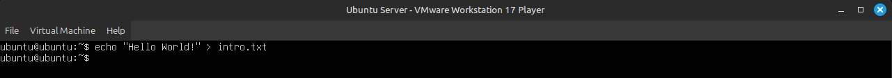
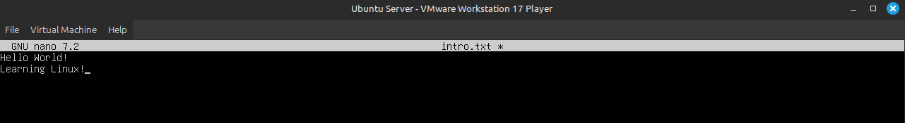
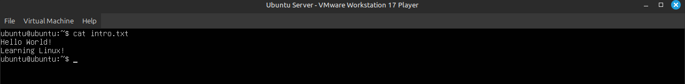
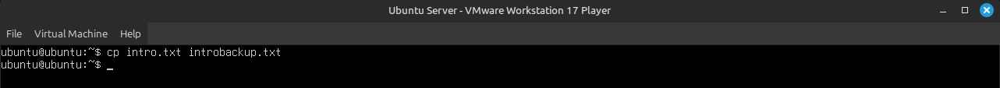
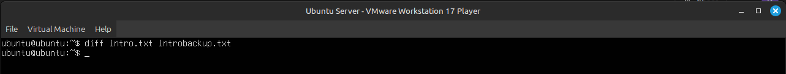
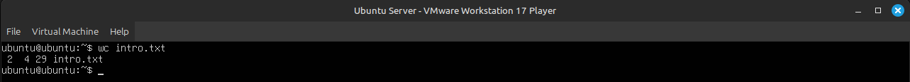
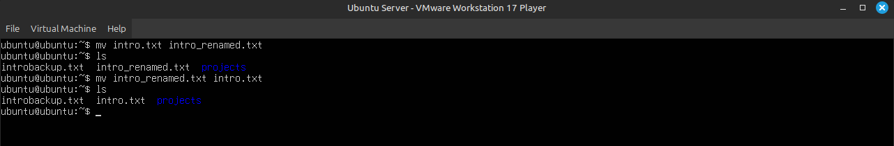

# Lab 2: Работа с файлами и их содержимым - заметки и выводы

---

### 1. Перейти в домашнюю директорию.

```bash
cd ~
```

### 2. Создать файл `intro.txt` с текстом:  `Hello Wordl!`

```bash
echo "My first Linux file." > intro.txt
```



* * *

### 3. Открыть файл в текстовом редакторе `nano`, добавить строку: `Learning Linux!`, сохранить и выйти.

```bash
nano intro.txt
```



* * *

### 4. Вывести содержимое файла в терминале.

```bash
cat intro.txt
```



* * *

### 5. Сделать копию файла под именем `introbackup.txt`.

```bash
cp intro.txt introbackup.txt
```



* * *

### 6. Проверить, что оба файла существуют и идентичны.

```bash
diff intro.txt introbackup.txt
```
Вывода не было - значит файлы одинаковые.




* * *


### 7. Посчитать количество строк и слов в файле.

```bash
wc intro.txt
```



* * *

### 8. Переименовать файл и вернуть обратно.

```bash
mv intro.txt intro_renamed.txt
mv intro_renamed.txt intro.txt
```



* * *

## Выводы

- Файл можно создать и сразу записать в него текст с помощью команды `echo >`.
- Редактировать текст удобно через nano, а сохранение выполняется сочетанием `Ctrl + O`, выход - `Ctrl + X`.
- Содержимое файла быстро просматривается через `cat`.
- Команда `cp` позволяет делать резервные копии файлов.
- `diff` помогает проверить, одинаковы ли два файла.
- `wc` показывает количество строк и слов — удобно для анализа текстов.
- `mv` используется как для переименования, так и для перемещения файлов.
- Базовая навигация (cd, pwd, ls) остаётся необходимой частью любой работы в терминале.
