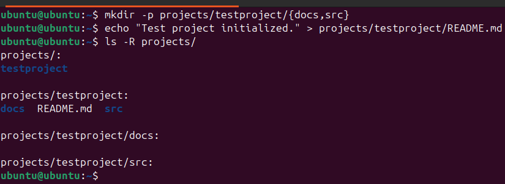
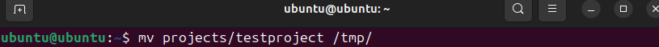
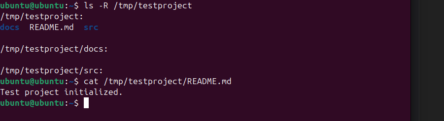
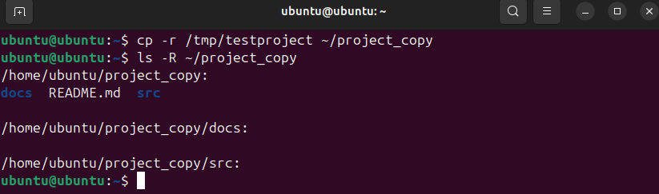
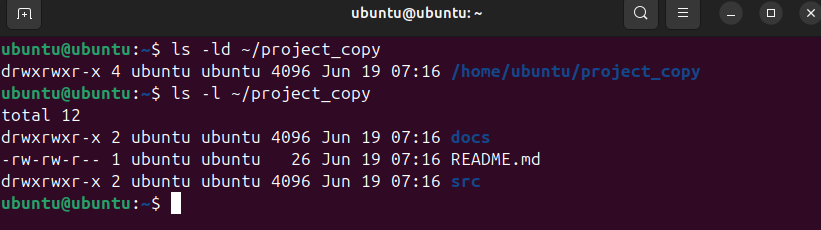
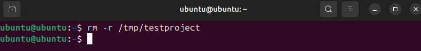
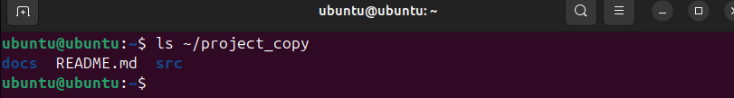

# Lab 3: Управление директориями

---

## 1. Создание структуры

```bash
cd ~
mkdir -p projects/testproject/{docs,src}
echo "Test project initialized." > projects/testproject/README.md
```



* * *

## 2. Перемещение проекта

```bash
mv projects/testproject /tmp/
```



* * *

## 3. Проверка структуры

```bash
ls -R /tmp/testproject
cat /tmp/testproject/README.md
```



* * *

## 4. Копирование проекта обратно

```bash
cp -r /tmp/testproject ~/project_copy
```



## 5. Проверка структуры копии

```bash
ls -R ~/project_copy
```

* * *

## 6. Просмотр прав доступа
```bash
ls -ld ~/project_copy
ls -l ~/project_copy
```



* * *

## 7. Удаление из /tmp

```bash
rm -r /tmp/testproject
```



* * *

## 8. Убедиться, что копия осталась

```bash
ls ~/project_copy
```



* * * 

## Выводы

- `mkdir -p` позволяет быстро создать вложенную структуру.
- `echo >` удобно использовать для создания и наполнения файлов.
- `mv` и `cp -r` помогают перемещать и копировать директории с содержимым.
- `ls -R` полезен для просмотра всей структуры сразу.
- Проверка через `ls -ld` и `ls -l` показывает права доступа и владельцев.
- `/tmp` удобно использовать как временное хранилище.
