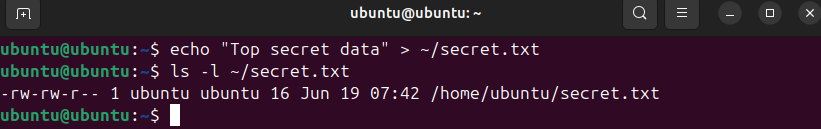
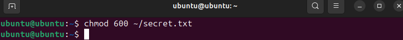
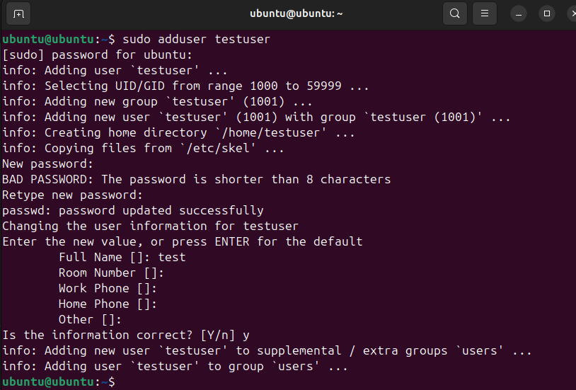
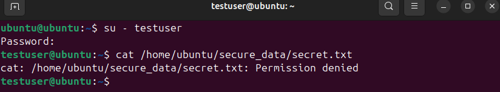
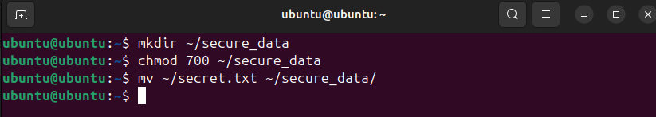
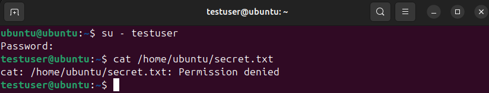
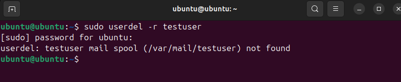

# Lab 4: Работа с правами доступа

---

## 1. Создание файла с секретной информацией

```bash
echo "Top secret data" > ~/secret.txt
```

* * *

## 2. Проверка текущих прав

```bash
ls -l ~/secret.txt
```



* * *

## 3. Изменение прав на rw------- (только для владельца)

```bash
chmod 600 ~/secret.txt
```



* * *

## 4. Создание нового пользователя для теста

```bash
sudo adduser testuser
```



* * *

## 5. Переключение и попытка чтения файла

```bash
su - testuser
cat /home/ubuntu/secret.txt  # ➜ Permission denied
exit
```



* * *

## 6. Работа с защищённой директорией

```bash
mkdir ~/secure_data
chmod 700 ~/secure_data
mv ~/secret.txt ~/secure_data/
```



* * *

## 7. Проверка доступа от другого пользователя

```bash
su - testuser
cat /home/ubuntu/secure_data/secret.txt
exit
```



* * *

## 8. Удаление testuser

```bash
sudo userdel -r testuser
```



* * *

## 9. Проверка umask

```bash
umask
```

* * *

## 10. Тестирование автоматических прав

```bash
touch newfile
mkdir newfolder
ls -l newfile newfolder
```


## Выводы

- `chmod 600` — надёжный способ ограничить доступ к файлу только для владельца.
- Права `rw-------` полностью блокируют чтение другими пользователями.
- `su` помогает проверить доступность файлов от имени другого пользователя.
- `700` на директории, это гарантия, что никто не зайдёт внутрь.
- `umask` влияет на дефолтные права, так что, важно понимать для создания безопасных скриптов.

