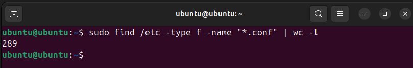
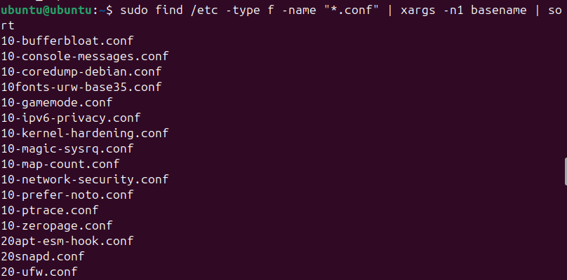
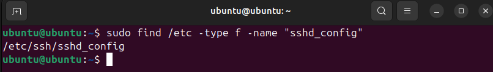
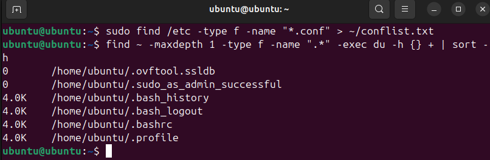
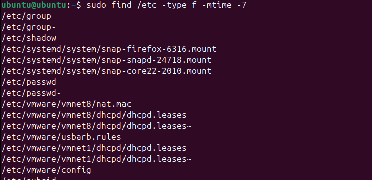
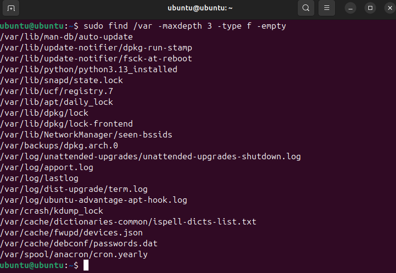
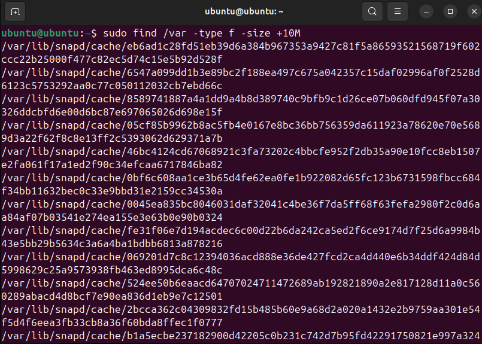
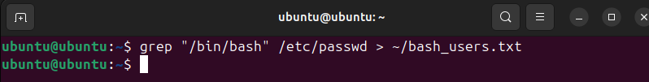

# Lab 5: Поиск и фильтрация файлов

## 1. Поиск .conf-файлов и подсчёт

```bash
find /etc -type f -name "*.conf" | wc -l
```



* * *

## 2. Вывод только имён файлов 

```bash
find /etc -type f -name "*.conf" | xargs -n1 basename | sort
```

- `basename` убирает путь, оставляя только имя файла.
- `sort` сортирует по алфавиту.



* * *

## 3. Поиск файла sshd_config

```bash
find /etc -type f -name "sshd_config"
```

- Указывает путь к файлу, обычно /etc/ssh/sshd_config.



* * *

## 4. Сохранение списка в файл

```bash
find /etc -type f -name "*.conf" > ~/conflist.txt
```

* * *

## 5. Скрытые файлы в домашней директории

```bash
find ~ -maxdepth 1 -type f -name ".*" -exec du -h {} + | sort -h
```



* * *

## 6. Поиск .log-файлов по дате

```bash
find /var -type f -name "*.log" -printf "%T@ %p\n" | sort -n
```

- `-printf "%T@ %p\n"` выводит время и путь.

* * * 

## 7. Файлы, изменённые за последние 7 дней

```bash
find /etc -type f -mtime -7
```



* * *

## 8. Пустые файлы в /var (до 3 уровней)

```bash
find /var -maxdepth 3 -type f -empty
```



* * *

## 9. Файлы больше 10 МБ

```bash
find /var -type f -size +10M
```



* * *

## 10. Пользователи с /bin/bash

```bash
grep "/bin/bash" /etc/passwd > ~/bash_users.txt
```



* * *

## Выводы

- `find` мощный инструмент для поиска по критериям: имени, размерам, дате изменения и другим параметрам.
- С помощью `wc -l` удобно подсчитывать количество найденных файлов.
- `basename` и `sort` позволяют очистить и упорядочить список имён для дальнейшей работы.
- `xargs` полезен при передаче вывода одной команды в другую, особенно при обработке длинных списков.
- Использование `-mtime`, `-size`, `-empty` помогает быстро находить файлы по состоянию.
- `grep` позволяет эффективно фильтровать строки в конфигурационных или системных файлах.
- Автоматизация таких поисков помогает в администрировании. Например, отслеживать лишние логи или пользователей с интерактивным доступом.
